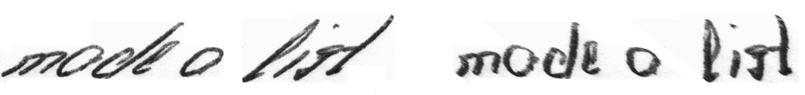
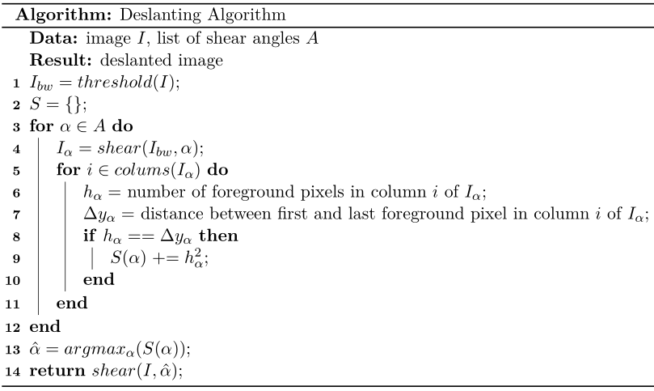

# Deslanting Algorithm

**Algorithm removes cursive writing style | Handwritten Text Recognition | C++ | OpenCV | OpenCL**

This algorithm sets (handwritten) text in images upright, i.e. it removes the cursive writing style.
It is used as a preprocessing step for handwritten text recognition.
The following illustration shows input and output of the algorithm for a given image (```data/test1.png```).



Two implementations are provided:
* CPU: all computations are done on the CPU using OpenCV.
* GPU: each column and shear angle is processed in parallel using OpenCL to compute the optimal shear angle, the remaining work is done on the CPU using OpenCV.


## Run demo

Use `./build.sh` to build the CPU version or `./build.sh gpu` to build the GPU version on Linux using g++.
Then, run `./DeslantImg` to process the two images provided in the `data/` directory (taken from IAM dataset \[2\]).
Two output files should occur in the repositories root directory.

Some notes on how to compile the demo manually and how to compile for Windows or other operating systems:

* Build **CPU** implementation on Linux (OpenCV must be installed):
```g++ --std=c++11 src/cpp/main.cpp src/cpp/DeslantImgCPU.cpp `pkg-config --cflags --libs opencv` -o DeslantImg ```
* If the macro **USE_GPU** is defined, the computation takes place on the GPU. Build **CPU and GPU** implementation on Linux (OpenCV and OpenCL must be installed):
```g++ --std=c++11 -D USE_GPU src/cpp/main.cpp src/cpp/DeslantImgCPU.cpp src/cpp/DeslantImgGPU.cpp src/cpp/CLWrapper.cpp `pkg-config --cflags --libs opencv` -lOpenCL -o DeslantImg```
* On Windows, the easiest way is to use Microsoft Visual Studio, put all files into a C++ project, set include and library paths for OpenCV and optionally OpenCL, and finally compile and run the program


## Documentation

Call function ```deslantImg(img, bgcolor)``` with the input image (grayscale) and the background color (to fill empty image space).
It returns the deslanted image computed on the **CPU**.

```
#include "DeslantImgCPU.hpp"
...

// read grayscale image
const cv::Mat img = cv::imread("data/test1.png", cv::IMREAD_GRAYSCALE);

// deslant it
const cv::Mat res = htr::deslantImg(img, 255);

// and save the result
cv::imwrite("out1.png", res);
```

The **GPU** version additionally takes an instance of ```CLWrapper``` which holds all relevant information needed for OpenCL: ```deslantImg(img, bgcolor, clWrapper)```.
As the construction of a ```CLWrapper``` instance takes time, it makes sense to only create one instance and use it for all future calls to ```deslantImg(img, bgcolor, clWrapper)```. 

```
#include "DeslantImgGPU.hpp"
...

// read grayscale image
const cv::Mat img = cv::imread("data/test1.png", cv::IMREAD_GRAYSCALE);

// deslant it
htr::CLWrapper clWrapper;
const cv::Mat res = htr::deslantImg(img, 255, clWrapper);

// and save the result
cv::imwrite("out1.png", res);
```


## Algorithm 

Vinciarelli and Luettin describe the algorithm in their paper \[1].
Here is a short outline of the algorithm:




## References

\[1\] Vinciarelli and Luettin - A new normalization technique for cursive handwritten words

\[2\] IAM dataset: http://www.fki.inf.unibe.ch/databases/iam-handwriting-database

